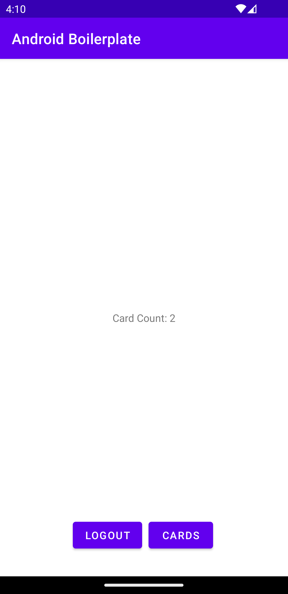

This is a boiler-plate app to get you started with the Atomic SDK for Android

The code is based around the [documentation] (https://documentation.atomic.io/sdks/android) and
designed to get you up and running as quickly as possible, not necessarily as best practice.

The app won't run out of the box, you will need to add your own values to `BoilerPlateViewModel`
in the companion object. 

Instructions are as follows

    - Open the [Atomic Workbench] (https://workbench.atomic.io/), and navigate to the Configuration area.
    - Under the 'SDK' header, your API host is in the 'API Host' section, your API key is in the 'API Keys' section
    - your environment ID is at the top of the page under 'Environment ID'.

## Runtime Variables

For an example of how to set runtime variables in your code, see `MainActivity` and the code starting
at `applyHandlers`

## Notifications

An example of how to receive and create in app notifications can be found in `BoilerplateFirebaseMessaging`
You will have to supply your own google-services.json file from your own app on the Firebase console.
Information for the whole process can be found [here](https://documentation.atomic.io/sdks/android#notifications)
including the Firebase setup documentation.

## Container updates branch

On this branch `feature/added-login-and-container-updates` there is an example of login/logoff flow with live container updates. 

Enter your configuration settings as per above and run the app.

You should see the start activity:

     
Tapping <code>LOGIN</code> will load the <code>HomeActivity</code> 
     

     
This screen shows the card count your account has active in the container. This will update live if new cards are sent. Tapping <code>LOGOUT</code> with call <code>AACSDK.logout()</code> which will clear all data and pop you back to the start activity.

Tapping `CARDS` will load the stream container fragment.

## Best practice code

If you check out `BoilerPlateViewModel` you will see how to start and stop streamContainerUpdates and also how to initialise and configure a stream container.

`HomeFragment` has an example of how to configure a `TextView` for live updates via the websocket for card counts.

`HomeActivity` has examples of how to call this code from a parent activity.

